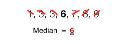

# [18- Diagnose which commit broke something with git bisect](https://egghead.io/lessons/tools-practical-git-diagnose-which-commit-broke-something-with-git-bisect)

## How `git bisect` Works

We use `git bisect` when we know there's a bug in our code but we don't know where. `git bisect` helps us to pinpoint the exact commit where things went wrong. Follow these steps!

1. To start the bisect process, run `git bisect start`.

2. Now that we're in a bisecting state, we need to find a commit where we know that our code is broken.

3. Once we've found a commit where your code is definitely broken, we have to mark it as our point of comparison using `git bad`.

4. Next, we find a commit where the code is work well. We can do this by using `git log --oneline`.

5. Once the working commit is found, grab the ID and run `git bisect good` followed by the ID.

We continue this process of testing our code, running `git bisect bad` and `git bisect good`. Git slices the search results until the broken commit is found. `git bisect` will even let us know how many results we have left to check. Once we've checked all of our results, Git will shows us the commit where the bug was introduced.

### Exiting `git bisect`

When we run `git bisect start` we're in a bisecting state. Once we've found our broken commit, we'll want to exit this state. We do this by running `git bisect rest`.

### How I think of `git bisect`

The process that `git bisect` uses to find the broken commit reminds me of finding the median in math. We have a sequence of numbers and we cross them out, once on the left, once on the right, until we reach our middle number.

Git uses `git bisect good` and `git bisect bad` to crosses out commits in a similar way. Visualizing it like this helps me understand how `git bisect` works.
